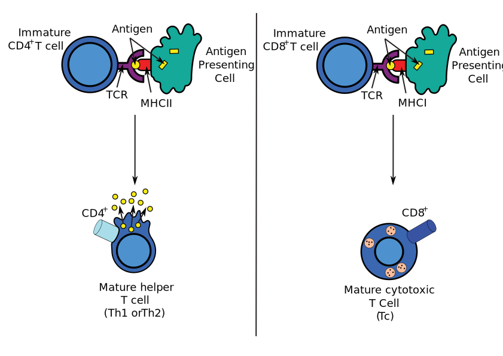

# Concepts of Immune Response
## Cell types

**[Antigen-presenting cell](https://en.wikipedia.org/wiki/Antigen-presenting_cell)**  is a cell that displays antigen complexed with major histocompatibility complexes (MHCs) on their surfaces.[^fn1]

* **[Dendritic cells](https://en.wikipedia.org/wiki/Dendritic_cell)** (DCs) are antigen-presenting cells (also known as accessory cells) of the mammalian immune system. Their main function is to process antigen material and present it on the cell surface to the T cells of the immune system. They act as messengers between the innate and the adaptive immune systems.[^fn3]

**[T cell](https://en.wikipedia.org/wiki/T_cell)** or T lymphocyte, is a type of lymphocyte (a subtype of white blood cell) that plays a central role in cell-mediated immunity.[^fn2]

* CD4 cells, also called T4 cells, are “helper” cells. They lead the attack against infections.

* CD8 cells, (T8 cells), are “suppressor” cells that complete the immune response. CD8+ cells can also be “killer” cells that kill cancer cells and other cells that are infected by a virus.

## Selection
*  **Beta selection**: produce mature T cells with a diverse array of functional T cell receptors, through the process of TCR gene rearrangement.     
*  **Positive selection**: "selects for" T cells capable of interacting with MHC. Only those that react weakly with a self peptide–MHC ligand are sekected.
*  **Negative selection**: removes thymocytes that are capable of strongly binding with "self" MHC peptides.  

## T-cell receptor
The T-cell receptor, or TCR, is a molecule found on the surface of T cells, or T lymphocytes, that is responsible for recognizing fragments of antigen as peptides bound to MHC molecules. 

# Mechanisms of T-cell receptor(TCR)

## Kinetic Proofreading

## Cross-reactive

**[Clonal selection theory](https://www.ncbi.nlm.nih.gov/pmc/articles/PMC534292/pdf/pnas00726-0053.pdf)**: individual lymphocytes are specific for a single antigen and that the recognition of alternative ligands is unlikely. [^fn4] This means the specificity is verly high.

**Challenge**: the protein sequence of the TCR is fixed and it means clonal selection theory need a large number of specific T cells.
> "The protein sequence of the TCR is fixed, and the TCR never undergoes affinity maturation. Thus, TCRs expressed by naive T cells are required to respond to all foreign antigens despite never having encountered them before and being unable to adapt to them at the protein sequence level." [^fn5]
  
**Solution** : Cross-reactive ability, the ability of the T-cell receptor (TCR) to recognize more than one peptide-MHC structure.

**proof:** individual T cell clones really can recognize over a million different individual peptides in the context of a single MHC molecule.

[^fn1]: <https://en.wikipedia.org/wiki/Antigen-presenting_cell>
[^fn2]: <https://en.wikipedia.org/wiki/T_cell>
[^fn3]: <https://en.wikipedia.org/wiki/Dendritic_cell>
[^fn4]: Jerne, Niels K. "The natural-selection theory of antibody formation." Proceedings of the National Academy of Sciences 41.11 (1955): 849-857.
[^fn5]:Sewell, Andrew K. "Why must T cells be cross-reactive?." Nature Reviews Immunology 12.9 (2012): 669.

